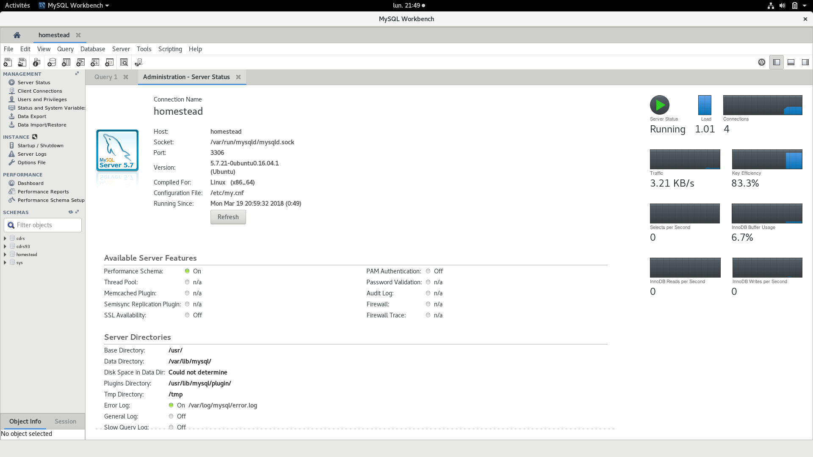
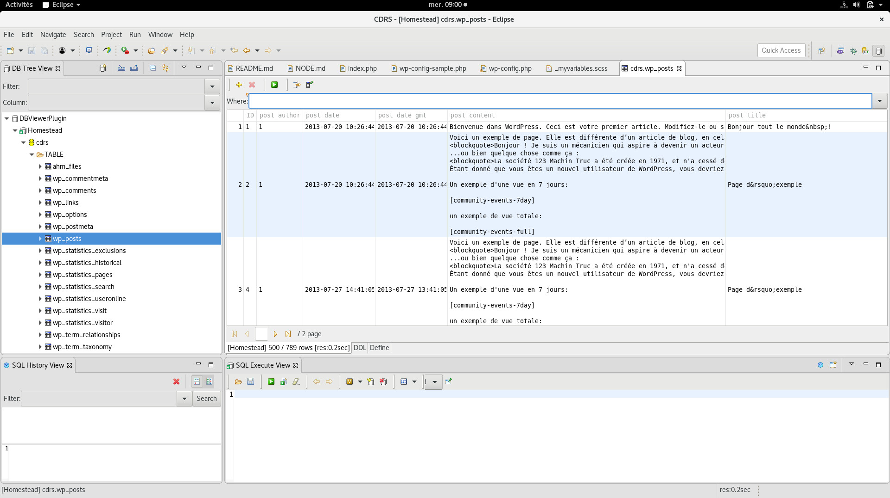

## Root USer:

* User: homestead
* Pass word: secret
* Port (on the Host): 33060 (see when the machine gets up 3306 on the Guest --> 33060 on the host)


## Commmand Line Tool mycli

* a Python Tool see [case of the CDRS93](CDRS/CDRS.md)
* It has the same functionality as a mysql cli + auto-completion

## A Big graphical tool: [MysqlWorkbench](https://dev.mysql.com/downloads/file/?id=474215)

* The Fedora's dnf commands makes the downloading + installing of dependencies before [the already downloaded rpm itself](https://dev.mysql.com/downloads/file/?id=474215)

```bash
# The Fedora's dnf commands makes the downloading + installing of dependencies before [the already downloaded rpm itself]
[jpmena@localhost Ateliers]$ sudo dnf install mysql-workbench-community-6.3.10-1.fc27.x86_64.rpm
Dernière vérification de l’expiration des métadonnées effectuée il y a 0:09:43 le lun. 19 mars 2018 21:24:54 CET.
Dépendances résolues.
=====================================================================================================================================================================================================================
 Paquet                                                        Architecture                               Version                                             Dépôt                                            Taille
=====================================================================================================================================================================================================================
Installation de :
 mysql-workbench-community                                     x86_64                                     6.3.10-1.fc27                                       @commandline                                      27 M
Installation des dépendances:
 libsodium                                                     x86_64                                     1.0.14-1.fc27                                       fedora                                           186 k
 libtomcrypt                                                   x86_64                                     1.18.0-1.fc27                                       updates                                          375 k
 libtommath                                                    x86_64                                     1.0-8.fc27                                          fedora                                            55 k
 libzip                                                        x86_64                                     1.3.2-1.fc27                                        updates                                           65 k
 pcre-cpp                                                      x86_64                                     8.41-6.fc27                                         updates                                           42 k
 proj                                                          x86_64                                     4.9.3-4.fc27                                        fedora                                           232 k
 python-ipaddress                                              noarch                                     1.0.18-2.fc27                                       fedora                                            39 k
 python2-asn1crypto                                            noarch                                     0.23.0-1.fc27                                       updates                                          176 k
 python2-bcrypt                                                x86_64                                     3.1.4-2.fc27                                        updates                                           41 k
 python2-cffi                                                  x86_64                                     1.10.0-3.fc27                                       fedora                                           227 k
 python2-crypto                                                x86_64                                     2.6.1-22.fc27                                       updates                                          487 k
 python2-cryptography                                          x86_64                                     2.0.2-3.fc27                                        updates                                          507 k
 python2-enum34                                                noarch                                     1.1.6-3.fc27                                        updates                                           57 k
 python2-idna                                                  noarch                                     2.5-2.fc27                                          fedora                                            98 k
 python2-paramiko                                              noarch                                     2.3.1-3.fc27                                        updates                                          286 k
 python2-ply                                                   noarch                                     3.9-4.fc27                                          fedora                                           107 k
 python2-pyasn1                                                noarch                                     0.3.7-1.fc27                                        updates                                          121 k
 python2-pycparser                                             noarch                                     2.14-11.fc27                                        fedora                                           146 k
 python2-pynacl                                                x86_64                                     1.1.2-1.fc27                                        fedora                                            61 k
 python2-six                                                   noarch                                     1.11.0-1.fc27                                       fedora                                            36 k

Résumé de la transaction
=====================================================================================================================================================================================================================
Installer  21 Paquets

Taille totale  : 30 M
Taille totale des téléchargements : 3.3 M
Taille des paquets installés : 203 M
Voulez-vous continuer ? [o/N] :o
Téléchargement des paquets :
(1/20): pcre-cpp-8.41-6.fc27.x86_64.rpm                                                                                                                                              164 kB/s |  42 kB     00:00    
(2/20): libzip-1.3.2-1.fc27.x86_64.rpm                                                                                                                                               247 kB/s |  65 kB     00:00    
(3/20): libtommath-1.0-8.fc27.x86_64.rpm                                                                                                                                             102 kB/s |  55 kB     00:00    
(4/20): python2-crypto-2.6.1-22.fc27.x86_64.rpm                                                                                                                                      565 kB/s | 487 kB     00:00    
(5/20): libtomcrypt-1.18.0-1.fc27.x86_64.rpm                                                                                                                                         497 kB/s | 375 kB     00:00    
(6/20): python2-pynacl-1.1.2-1.fc27.x86_64.rpm                                                                                                                                       354 kB/s |  61 kB     00:00    
(7/20): libsodium-1.0.14-1.fc27.x86_64.rpm                                                                                                                                           368 kB/s | 186 kB     00:00    
(8/20): python2-cffi-1.10.0-3.fc27.x86_64.rpm                                                                                                                                        465 kB/s | 227 kB     00:00    
(9/20): python2-paramiko-2.3.1-3.fc27.noarch.rpm                                                                                                                                     379 kB/s | 286 kB     00:00    
(10/20): python2-six-1.11.0-1.fc27.noarch.rpm                                                                                                                                        505 kB/s |  36 kB     00:00    
(11/20): python2-pycparser-2.14-11.fc27.noarch.rpm                                                                                                                                   663 kB/s | 146 kB     00:00    
(12/20): python2-ply-3.9-4.fc27.noarch.rpm                                                                                                                                           284 kB/s | 107 kB     00:00    
(13/20): python2-bcrypt-3.1.4-2.fc27.x86_64.rpm                                                                                                                                      127 kB/s |  41 kB     00:00    
(14/20): proj-4.9.3-4.fc27.x86_64.rpm                                                                                                                                                463 kB/s | 232 kB     00:00    
(15/20): python2-idna-2.5-2.fc27.noarch.rpm                                                                                                                                          682 kB/s |  98 kB     00:00    
(16/20): python-ipaddress-1.0.18-2.fc27.noarch.rpm                                                                                                                                   228 kB/s |  39 kB     00:00    
(17/20): python2-pyasn1-0.3.7-1.fc27.noarch.rpm                                                                                                                                      451 kB/s | 121 kB     00:00    
(18/20): python2-cryptography-2.0.2-3.fc27.x86_64.rpm                                                                                                                                655 kB/s | 507 kB     00:00    
(19/20): python2-enum34-1.1.6-3.fc27.noarch.rpm                                                                                                                                      225 kB/s |  57 kB     00:00    
(20/20): python2-asn1crypto-0.23.0-1.fc27.noarch.rpm                                                                                                                                 336 kB/s | 176 kB     00:00    
---------------------------------------------------------------------------------------------------------------------------------------------------------------------------------------------------------------------
Total                                                                                                                                                                                768 kB/s | 3.3 MB     00:04     
Test de la transaction en cours
La vérification de la transaction a réussi.
Lancement de la transaction de test
Transaction de test réussie.
Exécution de la transaction
  Préparation           :                                                                                                                                                                                        1/1 
  Installation de       : python2-six-1.11.0-1.fc27.noarch                                                                                                                                                      1/21 
  Installation de       : python2-enum34-1.1.6-3.fc27.noarch                                                                                                                                                    2/21 
  Installation de       : python2-asn1crypto-0.23.0-1.fc27.noarch                                                                                                                                               3/21 
  Installation de       : python2-pyasn1-0.3.7-1.fc27.noarch                                                                                                                                                    4/21 
  Installation de       : python2-idna-2.5-2.fc27.noarch                                                                                                                                                        5/21 
  Installation de       : python-ipaddress-1.0.18-2.fc27.noarch                                                                                                                                                 6/21 
  Installation de       : proj-4.9.3-4.fc27.x86_64                                                                                                                                                              7/21 
  Exécution du scriptlet: proj-4.9.3-4.fc27.x86_64                                                                                                                                                              7/21 
  Installation de       : python2-ply-3.9-4.fc27.noarch                                                                                                                                                         8/21 
  Installation de       : python2-pycparser-2.14-11.fc27.noarch                                                                                                                                                 9/21 
  Installation de       : python2-cffi-1.10.0-3.fc27.x86_64                                                                                                                                                    10/21 
  Installation de       : python2-bcrypt-3.1.4-2.fc27.x86_64                                                                                                                                                   11/21 
  Installation de       : python2-cryptography-2.0.2-3.fc27.x86_64                                                                                                                                             12/21 
  Installation de       : libsodium-1.0.14-1.fc27.x86_64                                                                                                                                                       13/21 
  Exécution du scriptlet: libsodium-1.0.14-1.fc27.x86_64                                                                                                                                                       13/21 
  Installation de       : python2-pynacl-1.1.2-1.fc27.x86_64                                                                                                                                                   14/21 
  Installation de       : python2-paramiko-2.3.1-3.fc27.noarch                                                                                                                                                 15/21 
  Installation de       : libtommath-1.0-8.fc27.x86_64                                                                                                                                                         16/21 
  Exécution du scriptlet: libtommath-1.0-8.fc27.x86_64                                                                                                                                                         16/21 
  Installation de       : libtomcrypt-1.18.0-1.fc27.x86_64                                                                                                                                                     17/21 
  Exécution du scriptlet: libtomcrypt-1.18.0-1.fc27.x86_64                                                                                                                                                     17/21 
  Installation de       : python2-crypto-2.6.1-22.fc27.x86_64                                                                                                                                                  18/21 
  Installation de       : libzip-1.3.2-1.fc27.x86_64                                                                                                                                                           19/21 
  Exécution du scriptlet: libzip-1.3.2-1.fc27.x86_64                                                                                                                                                           19/21 
  Installation de       : pcre-cpp-8.41-6.fc27.x86_64                                                                                                                                                          20/21 
  Exécution du scriptlet: pcre-cpp-8.41-6.fc27.x86_64                                                                                                                                                          20/21 
  Installation de       : mysql-workbench-community-6.3.10-1.fc27.x86_64                                                                                                                                       21/21 
  Exécution du scriptlet: mysql-workbench-community-6.3.10-1.fc27.x86_64                                                                                                                                       21/21 
Running as unit: run-r77db4069d1054b36b30019d501f91334.service
  Vérification de       : mysql-workbench-community-6.3.10-1.fc27.x86_64                                                                                                                                        1/21 
  Vérification de       : pcre-cpp-8.41-6.fc27.x86_64                                                                                                                                                           2/21 
  Vérification de       : libzip-1.3.2-1.fc27.x86_64                                                                                                                                                            3/21 
  Vérification de       : python2-crypto-2.6.1-22.fc27.x86_64                                                                                                                                                   4/21 
  Vérification de       : libtomcrypt-1.18.0-1.fc27.x86_64                                                                                                                                                      5/21 
  Vérification de       : libtommath-1.0-8.fc27.x86_64                                                                                                                                                          6/21 
  Vérification de       : python2-paramiko-2.3.1-3.fc27.noarch                                                                                                                                                  7/21 
  Vérification de       : python2-pynacl-1.1.2-1.fc27.x86_64                                                                                                                                                    8/21 
  Vérification de       : libsodium-1.0.14-1.fc27.x86_64                                                                                                                                                        9/21 
  Vérification de       : python2-cffi-1.10.0-3.fc27.x86_64                                                                                                                                                    10/21 
  Vérification de       : python2-six-1.11.0-1.fc27.noarch                                                                                                                                                     11/21 
  Vérification de       : python2-pycparser-2.14-11.fc27.noarch                                                                                                                                                12/21 
  Vérification de       : python2-ply-3.9-4.fc27.noarch                                                                                                                                                        13/21 
  Vérification de       : proj-4.9.3-4.fc27.x86_64                                                                                                                                                             14/21 
  Vérification de       : python2-bcrypt-3.1.4-2.fc27.x86_64                                                                                                                                                   15/21 
  Vérification de       : python2-cryptography-2.0.2-3.fc27.x86_64                                                                                                                                             16/21 
  Vérification de       : python-ipaddress-1.0.18-2.fc27.noarch                                                                                                                                                17/21 
  Vérification de       : python2-idna-2.5-2.fc27.noarch                                                                                                                                                       18/21 
  Vérification de       : python2-pyasn1-0.3.7-1.fc27.noarch                                                                                                                                                   19/21 
  Vérification de       : python2-asn1crypto-0.23.0-1.fc27.noarch                                                                                                                                              20/21 
  Vérification de       : python2-enum34-1.1.6-3.fc27.noarch                                                                                                                                                   21/21 

Installé :
  mysql-workbench-community.x86_64 6.3.10-1.fc27   libsodium.x86_64 1.0.14-1.fc27        libtomcrypt.x86_64 1.18.0-1.fc27           libtommath.x86_64 1.0-8.fc27              libzip.x86_64 1.3.2-1.fc27          
  pcre-cpp.x86_64 8.41-6.fc27                      proj.x86_64 4.9.3-4.fc27              python-ipaddress.noarch 1.0.18-2.fc27      python2-asn1crypto.noarch 0.23.0-1.fc27   python2-bcrypt.x86_64 3.1.4-2.fc27  
  python2-cffi.x86_64 1.10.0-3.fc27                python2-crypto.x86_64 2.6.1-22.fc27   python2-cryptography.x86_64 2.0.2-3.fc27   python2-enum34.noarch 1.1.6-3.fc27        python2-idna.noarch 2.5-2.fc27      
  python2-paramiko.noarch 2.3.1-3.fc27             python2-ply.noarch 3.9-4.fc27         python2-pyasn1.noarch 0.3.7-1.fc27         python2-pycparser.noarch 2.14-11.fc27     python2-pynacl.x86_64 1.1.2-1.fc27  
  python2-six.noarch 1.11.0-1.fc27                

Terminé !
```

### Connection's creation

* hostname localhost
* Port 33060
* user: homestead
* password: secret

#### To connect the Homestead Vagrant machine 

* has to be up !!!!

#### The result



## Eclipse PHP (Oxygen2) / DB Viwer

* Go to Help / Eclipses Market places
* Search for Databasse or DBViewer
  * Note that there is also an extension for Mongo DB
* restart ...
* Go to Open Perspecctive , choose *DBViewver*
  * TODO: ajouter le Driver / Pilote !!!

### Adding the  [mysql driver for java](https://dev.mysql.com/downloads/connector/j/)

* download the [mysql jav driver](https://dev.mysql.com/downloads/connector/j/)

```bash
[jpmena@localhost Ateliers]$ ls -ltr | tail -1
-rw-rw-r--.  1 jpmena jpmena   4434926 21 mars  08:46 mysql-connector-java-5.1.46.tar.gz
[jpmena@localhost Ateliers]$ ls -ltr mysql-connector-java-5.1.46
total 2452
drwxr-xr-x. 8 jpmena jpmena    4096 26 févr. 14:28 src
-rw-r--r--. 1 jpmena jpmena   63658 26 févr. 14:28 README.txt
-rw-r--r--. 1 jpmena jpmena   61407 26 févr. 14:28 README
-rw-r--r--. 1 jpmena jpmena 1004838 26 févr. 14:28 mysql-connector-java-5.1.46.jar # This jar
-rw-r--r--. 1 jpmena jpmena 1004840 26 févr. 14:28 mysql-connector-java-5.1.46-bin.jar #or that jar ????
-rw-r--r--. 1 jpmena jpmena   18122 26 févr. 14:28 COPYING 
-rw-r--r--. 1 jpmena jpmena  247456 26 févr. 14:28 CHANGES
-rw-r--r--. 1 jpmena jpmena   91845 26 févr. 14:28 build.xml
```

* When creating the new connnection I get asked for the Driver Path.
  * the Add File Button allows me to add one of the 2 jar files above

* next screen I change the dropdown list for a *mysql.jdbc.driver*
  * I let the Type 4
  * same qcreen:
    * connnection string : **jdbc:mysql://localhost:33060/homestead**
    * Database homestead
    * passsword secret
  * clic on the buttton: Test Connection !!! 
* Click next to select the Databases you wannt to see
* click Finish ....

### The result

* While opening cdrs93 Database:



### TODO metre une image de la base lue !!!!